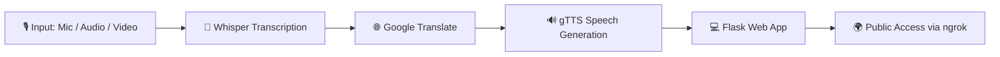

# MediaGenAI-Live-AI-Voice-Translator-Built-with-Whisper-gTTS🌍

**AI-powered multilingual voice translation using Whisper, Google Translate & gTTS**
**Tech Stack:** Python • Flask • Whisper • gTTS • MoviePy • Ngrok
**License:** MIT

---

## 🌟 Overview

**MediaGenAI** is an end-to-end **real-time speech-to-speech translation system** that listens, transcribes, translates, and speaks back in **12+ Indian languages**. Built using **OpenAI Whisper**, **Google Translate**, and **gTTS**, it provides seamless multilingual communication through a clean and modern web interface.

🎙️ **Record or upload audio/video**
🌐 **Translate into 12 Indian languages**
🔊 **Listen to the translated output instantly**
💻 **Access globally using ngrok**

---

## ⚡ Key Features

* 🎤 Real-time microphone recording
* 🎧 Upload audio/video for automatic translation
* 🧠 Multilingual transcription using Whisper
* 🌐 Translate into 12 Indian languages
* 🔊 High‑quality TTS playback using gTTS
* 🎨 Glassmorphism UI with smooth interactions
* 🚀 Public access using ngrok tunneling

---

## 🧠 Tech Stack

| Component               | Description                         |
| ----------------------- | ----------------------------------- |
| 🧩 **Whisper (OpenAI)** | Speech recognition & transcription  |
| 🌐 **Google Translate** | Multilingual translation engine     |
| 🔊 **gTTS**             | Text‑to‑Speech synthesis            |
| 🎬 **MoviePy**          | Extract audio from video files      |
| ⚙️ **Flask**            | Lightweight backend framework       |
| 🚀 **Ngrok**            | Secure public URL for global access |

---

## 🌍 Supported Languages

| Language | Code | Language  | Code |
| -------- | ---- | --------- | ---- |
| English  | en   | Marathi   | mr   |
| Hindi    | hi   | Gujarati  | gu   |
| Bengali  | bn   | Punjabi   | pa   |
| Tamil    | ta   | Nepali    | ne   |
| Telugu   | te   | Assamese  | as   |
| Kannada  | kn   | Malayalam | ml   |

---

## ⚙️ Installation Guide

### **1️⃣ Clone the Repository**

```bash
git clone https://github.com/ruchiikakengal/MediaGenAI-Live-AI-Voice-Translator-Built-with-Whisper-gTTS.git
cd MediaGenAI-Live-AI-Voice-Translator-Built-with-Whisper-gTTS
```

### **2️⃣ Install Dependencies**

```bash
pip install -r requirements.txt
```

Required packages (if creating new `requirements.txt`):

* SpeechRecognition
* googletrans==4.0.0-rc1
* gTTS
* pydub
* moviepy
* soundfile
* openai-whisper
* flask
* flask-ngrok
* pyngrok

---

## 🔑 3️⃣ Configure Ngrok

Inside `app.py`, add your token:

```python
NGROK_AUTH_TOKEN = "your_token_here"
```

Get token → ngrok dashboard.

---

## 🧩 System Workflow


---

## ✨ Features in Action

* 🔮 Glassmorphism UI with gradients
* 🎙️ Real-time mic recording
* 📁 Upload audio/video files
* 🗣️ Instant translated speech playback
* 📱 Mobile-friendly interface

---

## 🎬 Example Usage

| Step           | Description        | Example                |
| -------------- | ------------------ | ---------------------- |
| 🗣️ Input      | Speech detected    | "Hello, how are you?"  |
| 🌐 Translation | Hindi output       | "नमस्ते, आप कैसे हैं?" |
| 🔊 TTS         | Spoken translation | Hindi audio playback   |


---

## 🚀 Future Enhancements

* 🎤 Live streaming transcription
* 🧠 Speaker diarization (who spoke?)
* 📱 Mobile App (Flutter/React Native)
* 🎭 Emotion‑based voice translation
* ☁️ Cloud Deployment on AWS/GCP

---


## 💖 Acknowledgements

* 🧩 OpenAI Whisper
* 🌐 Google Translate API
* 🔊 gTTS
* ⚙️ Flask
* 🎬 MoviePy

---

If you find MediaGenAI helpful, ⭐ **star the repository on GitHub**!
